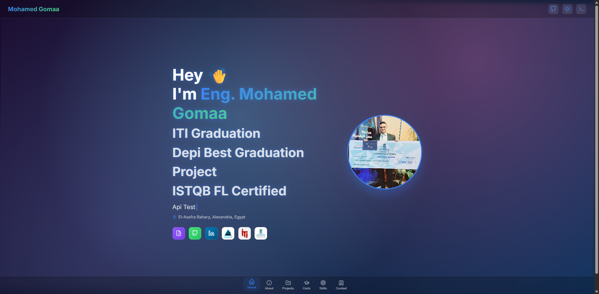
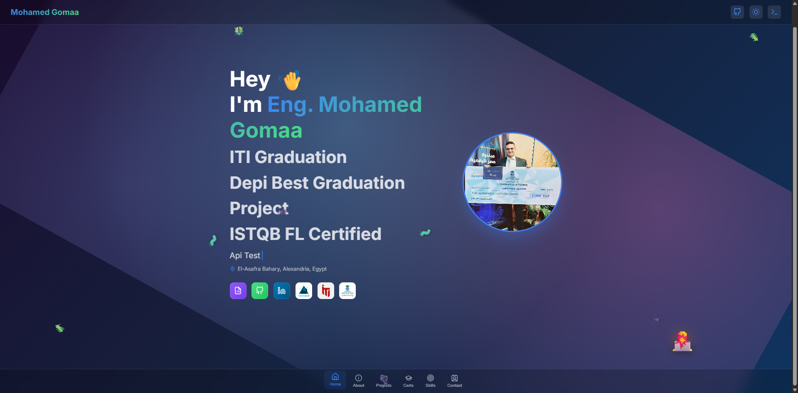
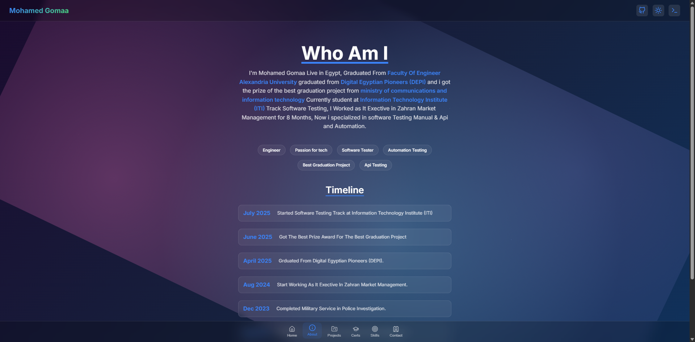
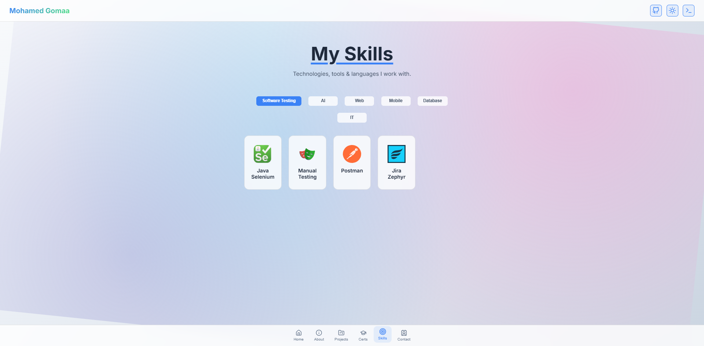
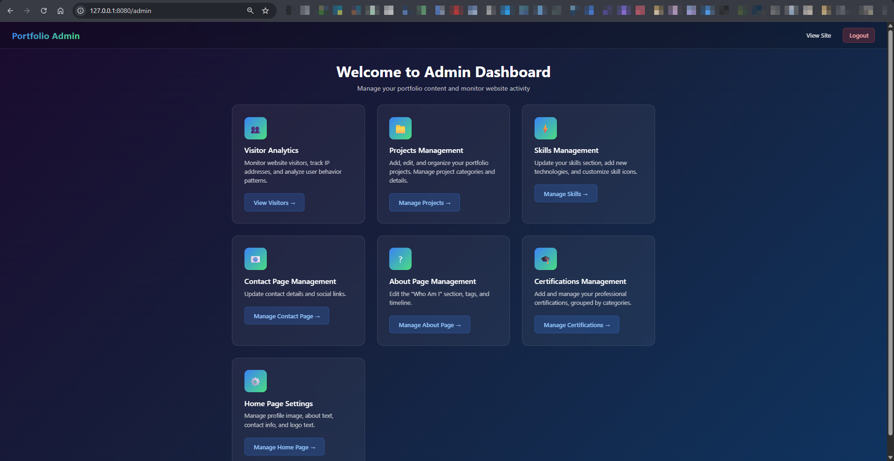
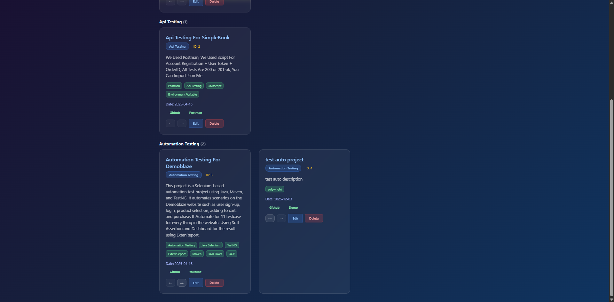
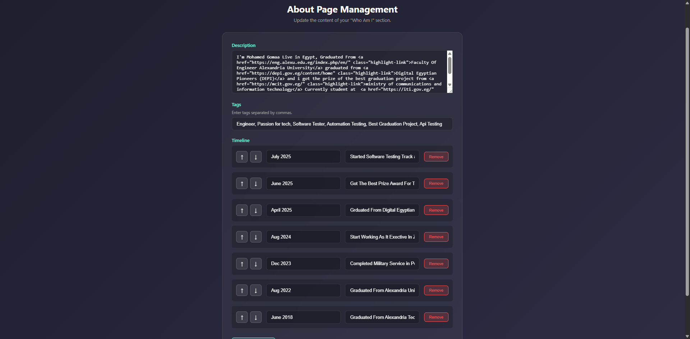

# 🚀 Mohamed Gomaa - Python Flask Portfolio

A modern, full-stack portfolio website built with **Python Flask** backend and a dynamic **JavaScript** frontend. Features a stunning dark theme with glassmorphism effects, animated intro sequence, and a complete admin dashboard for content management.


---

## 📑 Table of Contents

- [Features](#-features)
- [Screenshots](#-screenshots)
- [Tech Stack](#-tech-stack)
- [Project Structure](#-project-structure)
- [How It Works](#-how-it-works)
- [Installation](#-installation)
- [Usage](#-usage)
- [API Endpoints](#-api-endpoints)
- [Admin Panel](#-admin-panel)
- [Customization](#-customization)

---

## ✨ Features

### 🎨 Frontend
- **Stunning Intro Animation** - Curtain reveal effect with floating particles
- **Dark/Light Theme Toggle** - Seamless theme switching with smooth transitions
- **Terminal Mode** - Unique retro terminal UI option
- **Typing Animation** - Dynamic hero subtitle with typewriter effect
- **Responsive Design** - Mobile-first approach, works on all devices
- **Glassmorphism UI** - Modern frosted-glass card effects
- **Image Modal** - Zoom & pan functionality for project images
- **Video Integration** - YouTube embeds with lazy loading placeholders

### 📂 Sections
| Section | Description |
|---------|-------------|
| **Home** | Hero section with profile image, social links, and typing animation |
| **About** | Personal description, technology tags, and career timeline |
| **Projects** | Filterable project gallery with mockup displays |
| **Skills** | Categorized skills grid with custom icons |
| **Certifications** | Professional certifications showcase |
| **Contact** | Contact information with clickable links |

### 🔧 Backend
- **Admin Dashboard** - Full CMS for all content
- **Visitor Analytics** - Track page views, unique visitors, and session duration
- **JSON-based Storage** - No database needed, uses flat JSON files
- **Secure Authentication** - SHA-256 hashed password protection
- **RESTful API** - Clean API endpoints for frontend consumption

---

## 📸 Screenshots

### 🏠 Home Page



## animation


### 📁 About


### 🛠️ Skills Section in white mode



### 🔧 Admin Dashboard


### 📊 Visitor Analytics


## project controller


## about controller


## Home management

---

## 🛠 Tech Stack

### Backend
| Technology | Purpose |
|------------|---------|
| **Python 3.8+** | Server-side programming language |
| **Flask** | Lightweight WSGI web framework |
| **Jinja2** | Template engine for HTML pages |
| **Werkzeug** | Utility library for secure file handling |

### Frontend
| Technology | Purpose |
|------------|---------|
| **HTML5** | Semantic markup structure |
| **CSS3** | Styling with CSS variables, animations, and gradients |
| **JavaScript (ES6+)** | Dynamic interactions, API calls, DOM manipulation |
| **Inter Font** | Google Fonts for modern typography |

### Data Storage
| File | Content |
|------|---------|
| `data/config.json` | Site configuration (logo, hero text, social links) |
| `data/about.json` | About section content and timeline |
| `data/projects.json` | Projects data with mockup content |
| `data/skills.json` | Skills with categories and icons |
| `data/certifications.json` | Professional certifications |
| `data/categories.json` | Project categories |
| `data/skill_categories.json` | Skill category definitions |
| `data/contact.json` | Contact information items |
| `data/visitors.json` | Visitor tracking logs |

---

## 📁 Project Structure

```
mysite/
├── main.py                      # Flask application (backend)
├── README.md                    # This file
├── data/                        # JSON data storage
│   ├── about.json
│   ├── categories.json
│   ├── certifications.json
│   ├── config.json
│   ├── contact.json
│   ├── projects.json
│   ├── skill_categories.json
│   ├── skills.json
│   └── visitors.json
├── static/                      # Static frontend files
│   ├── index.html               # Main HTML (SPA-style)
│   ├── styles.css               # All CSS styles
│   ├── script.js                # Frontend JavaScript
│   ├── image/                   # Image assets
│   ├── video/                   # Video assets
│   ├── gif/                     # GIF assets
│   └── slides/                  # Slideshow images
└── templates/                   # Jinja2 admin templates
    ├── admin_dashboard.html
    ├── admin_home.html
    ├── admin_about.html
    ├── admin_projects.html
    ├── admin_skills.html
    ├── admin_certifications.html
    ├── admin_contact.html
    ├── visitor_analytics.html
    └── ...                      # More admin templates
```

---

## ⚙️ How It Works

### Architecture Overview

```
┌─────────────────────────────────────────────────────────────┐
│                        CLIENT                                │
│  ┌─────────────────────────────────────────────────────┐    │
│  │   index.html + styles.css + script.js               │    │
│  │   • Single Page Application (SPA) style             │    │
│  │   • Sections loaded dynamically via JavaScript      │    │
│  │   • API calls to fetch content from backend         │    │
│  └─────────────────────────────────────────────────────┘    │
└─────────────────────────────────────────────────────────────┘
                              │
                              ▼ HTTP Requests
┌─────────────────────────────────────────────────────────────┐
│                    FLASK SERVER (main.py)                    │
│  ┌─────────────────────────────────────────────────────┐    │
│  │   Routes:                                            │    │
│  │   • /               → Serve static index.html        │    │
│  │   • /api/*          → JSON API endpoints             │    │
│  │   • /admin/*        → Admin dashboard (Jinja2)       │    │
│  └─────────────────────────────────────────────────────┘    │
│  ┌─────────────────────────────────────────────────────┐    │
│  │   Data Layer:                                        │    │
│  │   • Read/Write JSON files in /data folder            │    │
│  │   • No database required                             │    │
│  └─────────────────────────────────────────────────────┘    │
└─────────────────────────────────────────────────────────────┘
```

### Request Flow

1. **User visits site** → Flask serves `static/index.html`
2. **JavaScript loads** → `PortfolioApp` class initializes
3. **API calls made** → Fetch config, projects, skills, etc.
4. **Content rendered** → DOM updated dynamically
5. **User navigates** → Sections show/hide with animations
6. **Admin login** → Session-based authentication
7. **Content updated** → JSON files modified, reflected immediately

### Key Components

#### Backend (`main.py`)

```python
# Flask app initialization
app = Flask(__name__, static_folder='static')
app.config['SECRET_KEY'] = 'your-secret-key'

# Admin authentication decorator
def admin_required(f):
    @wraps(f)
    def decorated_function(*args, **kwargs):
        if not session.get('admin_logged_in'):
            return redirect(url_for('admin_login'))
        return f(*args, **kwargs)
    return decorated_function

# Example API endpoint
@app.route('/api/projects')
def api_get_projects():
    with open(PROJECTS_FILE, 'r') as f:
        projects = json.load(f)
    return jsonify(projects)
```

#### Frontend (`script.js`)

```javascript
// Main application class
class PortfolioApp {
    constructor() {
        this.currentSection = 'home';
        this.init();
    }
    
    init() {
        this.initIntroAnimation();    // Curtain reveal
        this.setupEventListeners();    // Navigation, theme toggle
        this.loadProjects();           // Fetch from API
        this.loadSkills();             // Fetch from API
        this.loadConfig();             // Site configuration
        // ...more initialization
    }
    
    // Dynamic content loading
    loadProjects() {
        fetch('/api/projects')
            .then(res => res.json())
            .then(projects => this.renderProjects(projects));
    }
}
```

#### Styling (`styles.css`)

```css
/* CSS Variables for theming */
:root {
    --bg-primary: #1a0b2e;
    --accent-primary: #3b82f6;
    --card-bg: rgba(255, 255, 255, 0.05);
}

[data-theme="light"] {
    --bg-primary: #f8fafc;
    --accent-primary: #3b82f6;
    --card-bg: rgba(255, 255, 255, 0.8);
}
```

---

## 🚀 Installation

### Prerequisites
- Python 3.8 or higher
- pip (Python package manager)

### Steps

1. **Clone the repository**
   ```bash
   git clone https://github.com/mogomaa2025/mysite.git
   cd mysite
   ```

2. **Install Flask**
   ```bash
   pip install flask
   ```

3. **Run the application**
   ```bash
   python main.py
   ```

4. **Open in browser**
   ```
   http://localhost:8080
   ```

---

## 📖 Usage

### Viewing the Portfolio
- Navigate between sections using the **bottom navigation bar**
- Toggle between **dark/light themes** using the sun icon
- Enable **terminal mode** for a retro look
- Click on project images to **zoom and pan**
- Filter projects and certifications by **category**

### Visitor Tracking
The site automatically tracks:
- Page views and unique visitors
- Session duration per page
- User agent and IP (anonymized)
- Most visited pages

---

## 🔌 API Endpoints

| Endpoint | Method | Description |
|----------|--------|-------------|
| `/api/config` | GET | Site configuration |
| `/api/about` | GET | About section data |
| `/api/projects` | GET | All projects |
| `/api/skills` | GET | Skills list |
| `/api/skill-categories` | GET | Skill categories |
| `/api/categories` | GET | Project categories |
| `/api/certifications` | GET | Certifications list |
| `/api/certification-categories` | GET | Certification categories |
| `/api/contact` | GET | Contact information |
| `/api/track_visit` | POST | Log visitor data |
| `/api/update_visit_duration` | POST | Update session duration |

---

## 🔐 Admin Panel

Access the admin dashboard at `/admin/login`

### Features
| Section | Capabilities |
|---------|--------------|
| **Home** | Edit logo, hero title, subtitles, profile image, social links |
| **About** | Update description, tags, and timeline entries |
| **Projects** | Add/edit/delete/reorder projects with mockup content |
| **Skills** | Manage skills with icons (SVG, emoji, or image) |
| **Certifications** | Upload and organize professional certifications |
| **Contact** | Configure contact links and icons |
| **Visitors** | View analytics, export CSV, clear logs |
| **Categories** | Manage project, skill, and certification categories |

### Default Password
The admin password is hashed using SHA-256. To change it:

```python
# Generate a new hash
import hashlib
new_password = "your_new_password"
hash = hashlib.sha256(new_password.encode()).hexdigest()
# Update ADMIN_PASSWORD_HASH in main.py
```

---

## 🎨 Customization

### Changing Colors
Edit CSS variables in `static/styles.css`:

```css
:root {
    --accent-primary: #3b82f6;    /* Main accent color */
    --accent-secondary: #4ade80;  /* Secondary accent */
    --bg-primary: #1a0b2e;        /* Background color */
}
```

### Adding New Sections
1. Add HTML section in `static/index.html`
2. Add navigation button in the `bottom-nav`
3. Update `script.js` to handle the new section
4. Create API endpoint in `main.py` if needed

### Custom Icons
Skills support three icon formats:
- **SVG**: Inline SVG code
- **Emoji**: Single emoji character
- **Image**: `` tag

---

## 📄 License

This project is open source and available under the [MIT License](LICENSE).

---

## 👤 Author

**Mohamed Gomaa**
- GitHub: [@mogomaa2025](https://github.com/mogomaa2025)

---

<div align="center">
  <p>Built with ❤️ using Python Flask</p>
</div>
